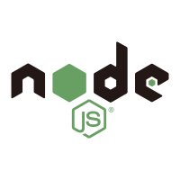

  
  <h1>
    Node.js 后端工程师学习路径
  </h1>
  

    Node.js 使用了全球最流行的 JavaScript 语言进行开发，并基于性能强悍的 V8 引擎，已经成为目前最热门的服务器开发平台之一。无论你是已经熟悉 JavaScript 的前端工程师，还是其他后端（例如 Java）工程师，抑或是编程新手，Node.js 都有十足的理由值得你学习和探索。
  

## 目录 <!-- omit in toc -->

- [入门](#%e5%85%a5%e9%97%a8)
  - [Node 基础](#node-%e5%9f%ba%e7%a1%80)
    - [知识点](#%e7%9f%a5%e8%af%86%e7%82%b9)
    - [实战教程](#%e5%ae%9e%e6%88%98%e6%95%99%e7%a8%8b)
- [进阶](#%e8%bf%9b%e9%98%b6)
  - [异步编程](#%e5%bc%82%e6%ad%a5%e7%bc%96%e7%a8%8b)
    - [知识点](#%e7%9f%a5%e8%af%86%e7%82%b9-1)
    - [实战教程](#%e5%ae%9e%e6%88%98%e6%95%99%e7%a8%8b-1)
  - [Web 后端开发](#web-%e5%90%8e%e7%ab%af%e5%bc%80%e5%8f%91)
    - [知识点](#%e7%9f%a5%e8%af%86%e7%82%b9-2)
    - [实战教程](#%e5%ae%9e%e6%88%98%e6%95%99%e7%a8%8b-2)
  - [自动化测试](#%e8%87%aa%e5%8a%a8%e5%8c%96%e6%b5%8b%e8%af%95)
    - [知识点](#%e7%9f%a5%e8%af%86%e7%82%b9-3)
    - [实战教程](#%e5%ae%9e%e6%88%98%e6%95%99%e7%a8%8b-3)
  - [实时应用开发](#%e5%ae%9e%e6%97%b6%e5%ba%94%e7%94%a8%e5%bc%80%e5%8f%91)
  - [应用部署](#%e5%ba%94%e7%94%a8%e9%83%a8%e7%bd%b2)
- [前沿](#%e5%89%8d%e6%b2%bf)
  - [GraphQL 服务开发](#graphql-%e6%9c%8d%e5%8a%a1%e5%bc%80%e5%8f%91)
- [参考资源](#%e5%8f%82%e8%80%83%e8%b5%84%e6%ba%90)
  - [JavaScript 语言基础](#javascript-%e8%af%ad%e8%a8%80%e5%9f%ba%e7%a1%80)
  - [HTTP 协议基础](#http-%e5%8d%8f%e8%ae%ae%e5%9f%ba%e7%a1%80)
  - [Node.js 理论](#nodejs-%e7%90%86%e8%ae%ba)
  - [Node.js 应用](#nodejs-%e5%ba%94%e7%94%a8)

## 入门

---

 

### Node 基础

> Node（或者说 Node.js，两者是等价的）是 JavaScript 的一种运行环境，是一个基于 Chrome V8 引擎建立的一个平台。由于采用了事件驱动、非阻塞 I/O 的模型，Node 能够成为了构建轻量且高效的 Web 应用的理想选择。万丈高楼平地起，掌握如何安装、模块机制、npm 工具链等基础知识对接下来 Node 的学习大有裨益。

#### 知识点

1. 安装
    - 各平台安装包
    - nvm
2. 编辑器环境安装
    - VSCode
    - ESLint
    - Prettier
3. 模块机制
    - CommonJS 规范
    - require、module 和 exports
4. npm
    - 基本命令
    - package.json
    - 切换 npm 源
    - npm scripts
5. 全局对象
    - process 对象
    - Buffer 对象
6. 事件

#### 实战教程

- ✍️《Node.js 开发环境搭建》 *🗝知识点 1、2、4*
- ✅[《一杯茶的时间，上手 Node.js》](https://tuture.co/2019/12/03/892fa12/) *🗝知识点 3、4、5、6*

 
<a href="#top">⬆️返回顶部</a>

---

 
<a href="#top">⬆️返回顶部</a>

## 进阶

### 异步编程

> Node.js 为异步而生，这也是它处理数据密集型实时应用（Data-intensive Real-time，DIRT）如此高效的原因。从浏览器端 JS 发源而来的事件机制与回调函数，到 ECMAScript 隆重推出的 Promise，Node.js 实现异步逻辑的方式也越来越现代化。这一节中，你将学会 Node.js 实现异步逻辑的各种方式，并且学会通过性能测试的方式，让你的 Node 代码更加高效。

#### 知识点

1. 异步 I/O 与原生事件循环
2. 回调函数，以及 async 库的优化
3. Promise 与 async/await
4. 性能测试与调优

#### 实战教程

- ✍️《Node.js 异步编程指北》 🗝知识点 1、2、3、4

 
<a href="#top">⬆️返回顶部</a>

---

 

### Web 后端开发

> 毫不夸张的说，Node 就是为 Web 而生的平台，其核心是由 Ryan Dahl 用 1500 行经过高度优化的 C 代码实现的流式 HTTP 解析器。如何用 Node 构建既健壮又高效的 Web 服务器应用，几乎是每个 Node 程序员的必修课。后端开发常用框架包括 Express 和 Koa，可任选其一进行学习。

#### 知识点

1. 路由的概念与定义
    - 路由的组成：HTTP 方法 + URI
    - 嵌套路由的实现
    - 动态路由的实现
2. 中间件
    - 中间件的概念
    - 使用第三方中间件
    - 编写自定义中间件
3. 模板引擎的使用
    - 模板引擎的语法（可选用 [Handlebars](https://handlebarsjs.com/)、[Pug](https://pug.bootcss.com/api/getting-started.html) 等）
    - 在服务器框架中接入模板引擎，渲染页面
4. RESTful API 的开发
    - 了解 HTTP 规范
    - 了解最常见的四个方法（GET、POST、PUT、DELETE）的含义
    - 在框架中响应不同的 HTTP 方法
5. 关系型数据库的接入（例如 MySQL）
    - 连接数据库，包括鉴权与重连机制
    - 定义数据模型
    - 实现增删改查
6. 文档型数据库的接入（例如 MongoDB）
    - 连接数据库，包括鉴权与重连机制
    - 定义数据模型
    - 实现增删改查
7. 集成 Redis 数据库

#### 实战教程

- ✅[《一杯茶的时间，上手 Express 框架开发》](https://tuture.co/2019/11/26/cd5b993/) 🗝知识点 1, 2, 3
- ✍️《一杯茶的时间，上手 Koa 框架开发》 🗝知识点 1, 2, 3
- ✅[《从零开始用 Express + MongoDB 搭建图片分享社区（一）》](https://tuture.co/2019/10/16/a0531f0/) 🗝知识点 1, 2, 3
- ✅[《从零开始用 Express + MongoDB 搭建图片分享社区（二）》](https://tuture.co/2019/10/16/29f41c0/) 🗝知识点 1, 2, 3, 6

 
<a href="#top">⬆️返回顶部</a>

---

 

### 自动化测试

> 自动化测试往往被忽视，但却是保障软件质量的关键一环。自动化测试解决了手工测试的繁琐、枯燥、易错的问题，让开发者能够专注于写出高质量的软件，同时也大大改善了团队协作的流程。自动化测试主要包括单元测试和集成测试（或称功能测试、验收测试等等），同时也涵盖了测试覆盖率、持续集成等知识点。

#### 知识点

1. 单元测试
    - 测试驱动开发（TDD）的概念
    - 行为驱动开发（BDD）的概念
    - 了解常用的测试框架（[Mocha](https://mochajs.cn/)、[Jest](https://jestjs.io/zh-Hans/)、[Jasmine](http://jasmine.github.io/) 等等）
    - 了解常用的断言库（内置 assert 模块、[Chai](https://github.com/chaijs/chai)、[unit.js](https://www.npmjs.com/package/unit.js) 等等）
    - 利用测试框架和断言库为 Node 模块编写单元测试
2. 集成测试
    - 了解浏览器自动化测试
    - 利用 [Karma](https://github.com/karma-runner/karma) 或 [Testcafe](https://devexpress.github.io/testcafe/) 进行集成测试
3. 测试覆盖率
    - 了解测试覆盖率的意义
    - 通过 [Codecov](https://codecov.io/)、[Jest](https://jestjs.io/zh-Hans/)（自带）或 [Istanbul](https://github.com/gotwarlost/istanbul) 生成测试覆盖率报告
4. 持续集成
    - 了解持续集成的意义
    - 了解常见的持续集成工具/平台（例如 [Travis CI](https://travis-ci.org/)、[Circle CI](https://circleci.com/) 或 [GitHub Action](https://help.github.com/en/actions)）
    - 配置持续集成，接入项目开发流程

#### 实战教程

- ✍️《一杯茶的时间，上手 Mocha 单元测试》 🗝知识点 1, 4
- ✍️《一杯茶的时间，上手 Karma 浏览器测试》 🗝知识点 2, 4

 
<a href="#top">⬆️返回顶部</a>

---

 

### 实时应用开发

🛠筹备中，敬请期待

 
<a href="#top">⬆️返回顶部</a>

---

 

### 应用部署

🛠筹备中，敬请期待

 
<a href="#top">⬆️返回顶部</a>

## 前沿

 

### GraphQL 服务开发

🛠筹备中，敬请期待

 
<a href="#top">⬆️返回顶部</a>

## 参考资源

### JavaScript 语言基础

🖥网络资源：

- [现代 JavaScript 教程](https://zh.javascript.info/)：遵循最新的 JavaScript 语言标准，由浅入深，足够详细，插图精美丰富，还涉及了浏览器相关知识，适合刚了解 HTML 和 CSS 基础的同学学习，也适合老司机查阅和复习。

- [MDN - JavaScript 基础](https://developer.mozilla.org/zh-CN/docs/Learn/Getting_started_with_the_web/JavaScript_basics)：权威的 JavaScript 文档，内容十分详细，涉及到前端开发的方方面面，适合查阅。

- [W3schools JavaScript 教程](https://www.quanzhanketang.com/js/default.html)（英文）：W3School 国内镜像站，内容简洁明了，包含大量可运行的实际代码片段，推荐零基础且英语较好的同学学习。

- [JavaScript Promise迷你书](http://liubin.org/promises-book/)：专注于讲透 JavaScript Promise 这个知识点，强烈推荐至今对 Promise 似懂非懂的同学学习。

📚书籍推荐：

- [《ECMAScript 6 入门》- 阮一峰](http://es6.ruanyifeng.com/)：阮一峰老师开源的 JavaScript 语言教程，重在介绍 ECMAScript 6（简称 ES6）引入的新语法特性，推荐想要了解 ES6 新特性的同学学习。

### HTTP 协议基础

- [MDN - HTTP 概述](https://developer.mozilla.org/zh-CN/docs/Web/HTTP/Overview)：权威的 HTTP 协议概述。

- [十分钟搞懂 HTTP 和 HTTPS 协议](https://zhuanlan.zhihu.com/p/72616216)：在让你快速了解 HTTP 协议的同时，也了解 HTTPS 出现的背景和意义。

- [阮一峰 - HTTP 协议入门](http://www.ruanyifeng.com/blog/2016/08/http.html)：阮一峰老师的 HTTP 协议介绍资料，具有不错的参考价值。

### Node.js 理论

🖥网络资源：

- [狼叔：如何正确的学习Node.js](https://i5ting.github.io/How-to-learn-node-correctly/)：讲解了 Node.js 的相关基础知识，还分享了自己的成长经历和求职指南。

- [Node.js技术栈](https://www.nodejs.red/)：涵盖了 JavaScript、ES6、Node.js、数据结构与算法、数据库、微服务、DevOps 等方方面面的知识。

📚书籍推荐：

- [《深入浅出 Node.js》- 朴灵](https://book.douban.com/subject/25768396/)：朴灵老师所撰 Node.js 理论进阶书籍，深入理解 Node.js 必备。

### Node.js 应用

🖥网络资源：

- [MDN Express 教程](https://developer.mozilla.org/zh-CN/docs/Learn/Server-side/Express_Nodejs)：通过搭建一个图书馆应用，讲解 Express 框架各方面的知识。

- [Koa2进阶学习笔记](https://chenshenhai.github.io/koa2-note/)：涵盖 Koa 2 的各方面使用，每个知识点都配有实例代码可供学习。

📚书籍推荐：

- [Node.js实战（第2版）](https://book.douban.com/subject/30288107/)：结合大量实例介绍如何用 JavaScript 和 Node 创建高性能的 Web 服务器，涵盖异步编程、状态管理、事件驱动编程等关键设计理念，旨在帮助读者成功晋级全栈开发。
